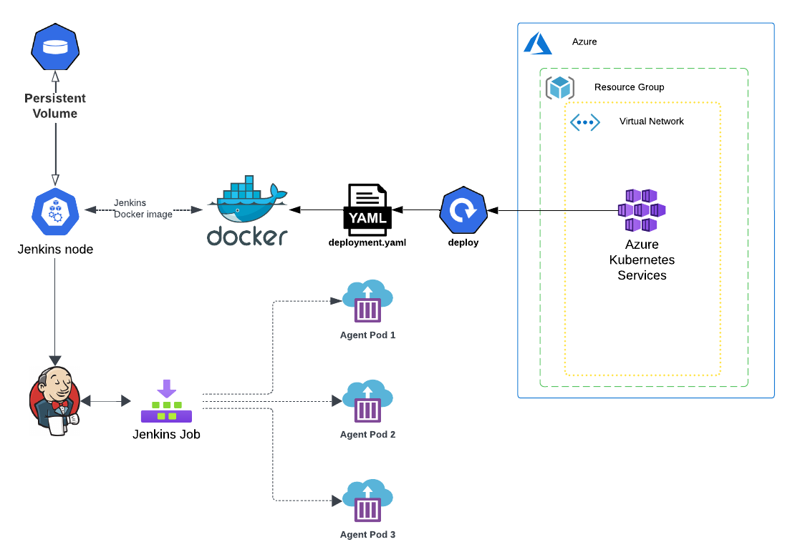
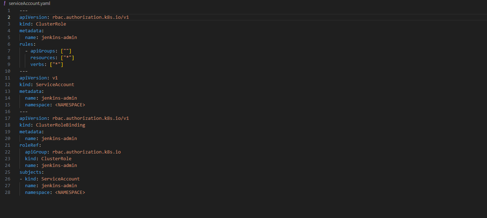
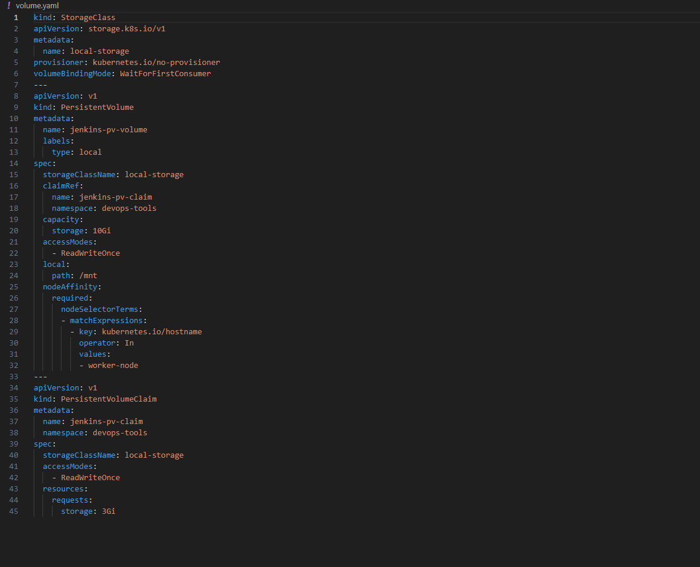
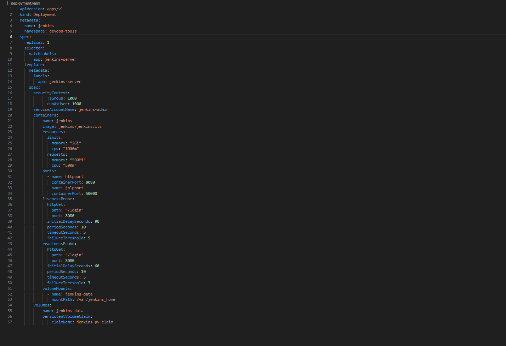
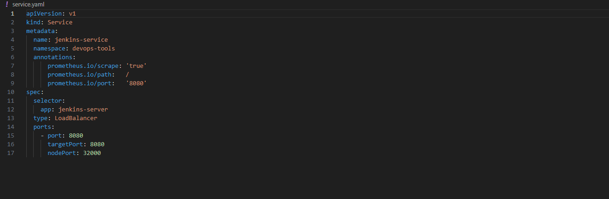
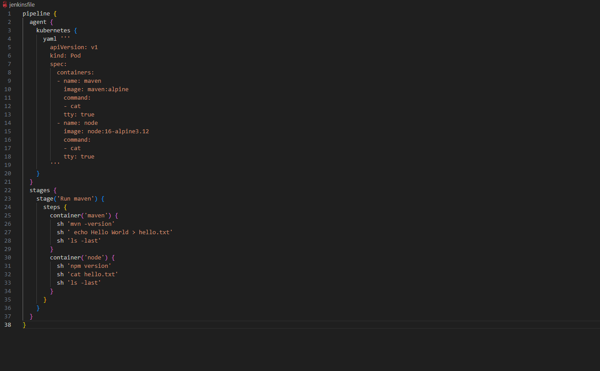

# Jenkins on Kubernetes with Dynamic Build Agents

This project demonstrates how to install and configure Jenkins on an Azure Kubernetes Service (AKS) cluster. Jenkins will be set up to dynamically provision pods as build agents, allowing for efficient resource utilization and scalable build environments.

The setup also includes a persistent volume for Jenkins data, ensuring that configurations and job history are preserved across pod restarts.

## Table of Contents

- [Architecture Overview](#architecture-overview)
- [Prerequisites](#prerequisites)
- [Setup Steps](#setup-steps)
  - [1. Provision Azure Kubernetes Service (AKS) with Terraform](#1-provision-azure-kubernetes-service-aks-with-terraform)
  - [2. Connect to the AKS Cluster](#2-connect-to-the-aks-cluster)
  - [3. Deploy Jenkins to AKS](#3-deploy-jenkins-to-aks)
  - [4. Configure Jenkins](#4-configure-jenkins)
  - [5. Configure Kubernetes Plugin in Jenkins](#5-configure-kubernetes-plugin-in-jenkins)
- [Running Jenkins Jobs](#running-jenkins-jobs)
  - [Standard Jenkins Job](#standard-jenkins-job)
  - [Benchmark Job](#benchmark-job)
- [Accessing Jenkins UI](#accessing-jenkins-ui)
- [Repository File Structure](#repository-file-structure)

## Architecture Overview

The following diagram illustrates the overall architecture:


> *Figure 1: System Architecture*

**All YAML configuration files referenced in this guide are available in this repository.**

## Prerequisites

Before you begin, ensure you have the following:

- An active Azure subscription.
- [Azure CLI](https://docs.microsoft.com/en-us/cli/azure/install-azure-cli) installed and configured.
- [Terraform CLI](https://learn.hashicorp.com/tutorials/terraform/install-cli) installed.
- [kubectl](https://kubernetes.io/docs/tasks/tools/install-kubectl/) installed.

## Setup Steps

Follow these steps to deploy and configure Jenkins on AKS.

### 1. Provision Azure Kubernetes Service (AKS) with Terraform

The Terraform scripts in the `terraform/` directory will provision the necessary AKS cluster.

1.  **Navigate to the Terraform directory**:
    ```bash
    cd terraform
    ```
2.  **Update Subscription ID**:
    Open `main.tf` and replace the placeholder `subscription_id` with your actual Azure Subscription ID.
    ```terraform
    provider "azurerm" {
      features {}
      subscription_id = "YOUR_AZURE_SUBSCRIPTION_ID" # <-- UPDATE THIS
    }
    ```
3.  **Initialize Terraform**:
    ```bash
    terraform init
    ```
4.  **Apply Terraform Configuration**:
    This command will create the AKS cluster and other resources defined in the `.tf` files.
    ```bash
    terraform apply
    ```
    Confirm the action when prompted by typing `yes`.
5.  **Verify Resources**:
    After the apply completes, you can find the newly created AKS cluster in the Azure portal. The output of `terraform apply` will also display useful information, such as the cluster name and node IP (which might be used later to access Jenkins).

### 2. Connect to the AKS Cluster

Once the AKS cluster is provisioned, configure `kubectl` to connect to it.

1.  **Log in to Azure (if not already logged in)**:
    ```bash
    az login
    ```
2.  **Set the Azure Subscription**:
    Replace `<subscription_id>` with your Azure subscription ID (the same one used in `main.tf`).
    ```bash
    az account set --subscription <subscription_id>
    ```
3.  **Download Cluster Credentials**:
    Replace `<resource_group_name>` and `<kubernetes_service_name>` with the values from your Terraform setup. The default resource group name is `kube-rg`, and the default Kubernetes service name is `kube-cluster-aks1` (as defined in `terraform/main.tf`).
    ```bash
    az aks get-credentials --resource-group <resource_group_name> --name <kubernetes_service_name>
    ```
    For example:
    ```bash
    az aks get-credentials --resource-group kube-rg --name kube-cluster-aks1
    ```

### 3. Deploy Jenkins to AKS

This section details deploying Jenkins using the provided Kubernetes YAML manifests.

1.  **Create a Namespace for Jenkins**:
    It's good practice to run Jenkins in its own namespace.
    ```bash
    kubectl create namespace jenkins
    ```
    *(This guide will use `jenkins` as the namespace. If you choose a different name, update the YAML files accordingly.)*

2.  **Create Service Account**:
    The `serviceAccount.yaml` file defines the necessary permissions for Jenkins to interact with the Kubernetes API (e.g., to create and manage build agent pods).
    ```bash
    kubectl apply -f serviceAccount.yaml -n jenkins
    ```
    *Image of `serviceAccount.yaml` (for reference):*
    

3.  **Create Persistent Volume and Claim**:
    The `volume.yaml` file defines a `StorageClass`, `PersistentVolume` (PV), and `PersistentVolumeClaim` (PVC) to provide stable storage for Jenkins data (`/var/jenkins_home`).
    **Important**: Before applying, you **must** update `volume.yaml`. Replace `aks-nodepool-38444383-vmss000000` in the `nodeAffinity` section with the actual hostname of one of your AKS cluster worker nodes.
    To get worker node hostnames:
    ```bash
    kubectl get nodes -o wide
    ```
    Then, apply the manifest:
    ```bash
    kubectl apply -f volume.yaml -n jenkins
    ```
    *Image of `volume.yaml` (for reference):*
    

4.  **Deploy Jenkins**:
    The `deployment.yaml` file describes the Jenkins deployment, including:
    *   `securityContext` for file permissions on the persistent volume.
    *   Liveness and readiness probes for health monitoring.
    *   Volume mounts for the Jenkins home directory.
    Ensure the namespace in the manifest matches the one you created (e.g., `jenkins`).
    ```bash
    kubectl apply -f deployment.yaml -n jenkins
    ```
    The deployment might take a few minutes. You can monitor its status:
    ```bash
    kubectl get deployments -n jenkins
    kubectl describe deployments jenkins -n jenkins
    ```
    *Image of `deployment.yaml` (for reference):*
    

5.  **Expose Jenkins via a Service**:
    The `service.yaml` file creates a `LoadBalancer` service to expose Jenkins externally.
    Ensure the namespace in the manifest matches.
    ```bash
    kubectl apply -f service.yaml -n jenkins
    ```
    *Image of `service.yaml` (for reference, though the image name in the original README was `volume.yaml.png` for the service, which might be a typo):*
    

### 4. Configure Jenkins

1.  **Access Jenkins UI**:
    The Jenkins service is of type `LoadBalancer`. Find its external IP address:
    ```bash
    kubectl get svc jenkins-service -n jenkins -o jsonpath='{.status.loadBalancer.ingress[0].ip}'
    ```
    Wait for an external IP to be assigned. Once available, open `http://<external-ip>:8080` in your browser.

2.  **Unlock Jenkins**:
    Retrieve the initial administrator password from the Jenkins pod logs:
    First, get the Jenkins pod name:
    ```bash
    kubectl get pods -n jenkins -l app=jenkins-server
    ```
    Then, view the logs (replace `<jenkins-pod-name>` with the actual name):
    ```bash
    kubectl logs <jenkins-pod-name> -n jenkins
    ```
    Copy the password, paste it into the "Administrator password" field in your browser, and click "Continue."

3.  **Customize Jenkins**:
    *   Click "Install suggested plugins."
    *   Create an admin user when prompted.

### 5. Configure Kubernetes Plugin in Jenkins

1.  **Install Kubernetes Plugin**:
    *   Navigate to `Manage Jenkins` > `Plugins`.
    *   Go to the `Available plugins` tab and search for `Kubernetes`.
    *   Select the plugin and click `Download now and install after restart` (or `Install without restart`).

2.  **Configure Kubernetes Cloud**:
    *   Navigate to `Manage Jenkins` > `Nodes and Clouds` > `Clouds`.
    *   Click `New cloud` and check the type `Kubernetes`.
    *   **Name**: Give your cloud configuration a name (e.g., `kubernetes`).
    *   **Kubernetes URL**: Set this to the Kubernetes control plane address. You can typically find this with:
        ```bash
        kubectl cluster-info
        ```
    *   **Kubernetes Namespace**: Set this to the namespace where Jenkins is running and where build agent pods should be created (e.g., `jenkins`). This should be the same namespace associated with the `jenkins-admin` service account.
    *   **Test Connection**: Click `Test Connection`. 
        If successful, you should see a confirmation message.
    *   **Enable WebSocket**: Check the `Use WebSocket` option for more responsive communication between Jenkins master and agents.
    *   Review other options as needed, then click `Save`.
    > other settings can be left as default for basic setups.

## Running Jenkins Jobs

This repository includes example `jenkinsfile` configurations.

### Standard Jenkins Job

The `jenkinsfile` in the root directory demonstrates a basic pipeline that uses multiple containers (Maven and Node.js) within a dynamically provisioned Kubernetes pod.

*   Create a new Pipeline job in Jenkins.
*   In the "Definition" section, choose "Pipeline Script" and simply paste the contents of the `jenkinsfile` 
into the script area.
*   Save and run the job. Jenkins will spin up a pod with the specified containers, execute the steps, and then remove the pod.

*Image of `jenkinsfile` (for reference):*


### Benchmark Job

The `benchmark/jenkinsfile` is designed to test the performance of pod creation and deletion on your Kubernetes cluster.

*   Create another Pipeline job in Jenkins.
*   Configure it similarly to the standard job.
*   The pipeline will:
    1.  Create a specified number of pods in parallel.
    2.  Measure the time taken for creation.
    3.  Delete these pods in parallel.
    4.  Measure the time taken for deletion.
    5.  Output a summary of the benchmark.

### Conclusion

This guide has walked you through the process of deploying Jenkins on Azure Kubernetes 
Service with dynamic build agents. 
You can now leverage Jenkins to run your CI/CD pipelines efficiently, 
using the scalability and flexibility of Kubernetes.

